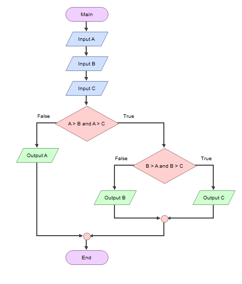

# labspy02
## if,elif,else
## Menentukan Nilai Bilangan Terbesar dari 3 Buah Bilangan
### Flowchart 
- Berikut flowchart, untuk menentukan bilangan terbesar dari 3 buah bilangan

### Menggunakan statement if, untuk mencari nilai dari 3 buah bilangan
- Disini saya menginisialisasikan "a" sebagai bilangan pertama, "b" sebagai bilangan kedua, "c" sebagai bilangan ketiga.
- Dengan cara statement if untuk "a" sebagai bilangan pertamma, elif untuk "b" sebagai bilangan kedua, elif untuk "c" sebagai bilangan ketiga, dan else jika false atau salah, maksudnya jika inputan user di luar program, dia akan menampilkan ini.
- Berikut program yang saya buat

