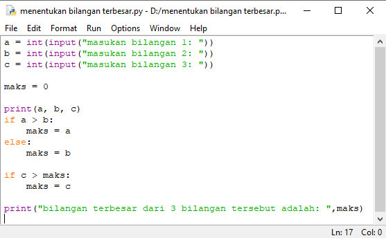
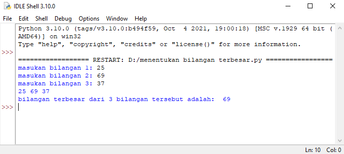
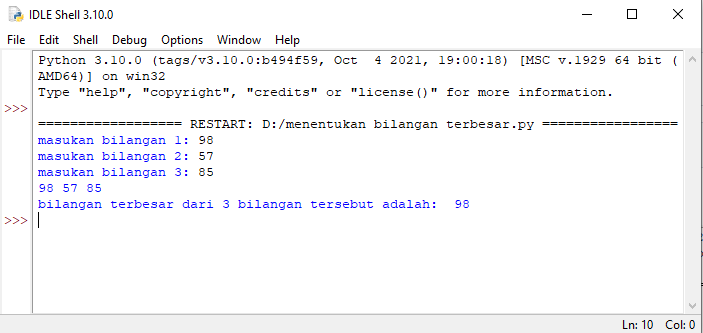
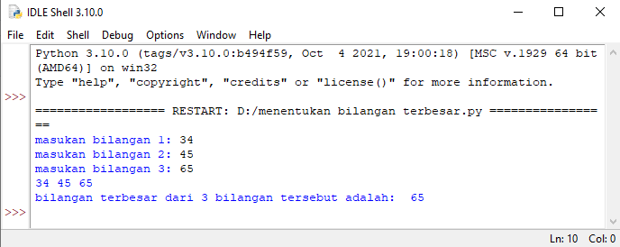

# labspy02
## if,elif,else
## Menentukan Nilai Bilangan Terbesar dari 3 Buah Bilangan
### Flowchart 
- Berikut flowchart, untuk menentukan bilangan terbesar dari 3 buah bilangan

### Menggunakan statement if, untuk mencari nilai dari 3 buah bilangan
- Disini saya menginisialisasikan "a" sebagai bilangan pertama, "b" sebagai bilangan kedua, "c" sebagai bilangan ketiga.
- Dengan cara statement if untuk "a" sebagai bilangan pertamma, elif untuk "b" sebagai bilangan kedua, elif untuk "c" sebagai bilangan ketiga, dan else jika false atau salah, maksudnya jika inputan user di luar program, dia akan menampilkan ini.
- Berikut program yang saya buat

 ## Beriikut hasil program yang saya buat
 ### kapan variabel "b" dikatakan yang paling besar? variabel "b" dikatakan yang paling besar, ketika ia lebih besar dari nilai "a", dan juga lebih besar dari niai "c"
- Hasil program bilangan pertama yang terbesar

### Kapan variabel "a" dikatakam yang paling besar? variabel "a" dikatakan yang paling besar, ketika ia lebih besar dari nilai "b", dan juga lebih beesar dari nilai "c"
- Hasil program bilangan kedua yang terbesar

### Kapan variabel "c" dikatakam yang paling besar? variabel "c" dikatakan yang paling besar, ketika ia lebih besar dari nilai "a", dan juga lebih beesar dari nilai "b"
- Hasil program bilangan ketiga yang terbesar

## Kelemaham program yang saya buat adalah, jika kita memasukan 2 angka yang sama, maka nilai terakhir dari kedua variabel itu yang terbesar
### Contoh: a= 9, b= 9, c= 7, maka b= 6 lah yang dianggap bilangan yang terbesar

# Mungkin segitu saja dari saya, kurang lebihnya mohon dimaafkan 
# Trimakasih
